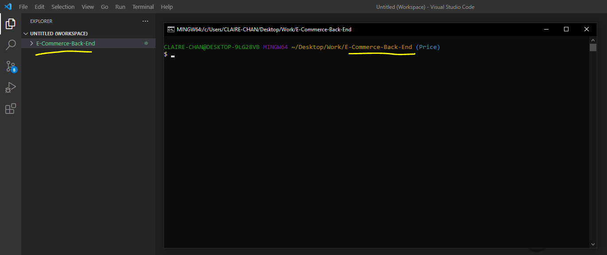

# E-commerce Back End Starter Code

## Description

This project creates the back end for an e-commerce site by utilizing an Express.js API to use Sequelize in order to access and interact with the site's MySQL database.

This project utilizes [Node.js version 16.18.0](https://nodejs.org/en/) and the [Node MySQL 2 version 3.1.0](https://www.npmjs.com/package/mysql2) package from [npm, Inc.](https://www.npmjs.com/) to ________________________________________________________. 

The development of this project also utilized [Insomnia version 2022.7.5](https://insomnia.rest/) to test SQL querying functions through testing routes and [MySQL WorkBench version 8.0.32](https://dev.mysql.com/doc/workbench/en/) to visualize the contents of the databases, test queries, as well as the changes that occurred.
"nodemon": "^2.0.3
"dotenv": "^8.2.0",
"express": "^4.17.1",
"mysql2": "^2.1.0",
"sequelize": "^5.21.7"

## Table of Contents
- [Installation](#installation)
    - [Git/GitBash](#gitgitbash---strongly-recommended)
    - [Visual Studio Code](#visual-studio-code-vsc---strongly-recommended)
    - [Node (REQUIRED)](#node-version-16---required-to-download-node-based-dependencies-ie-inquirer-my-sql-2-express-and-consoletable)
    - [Node My SQL 2 (REQUIRED)](#node-my-sql-2-version-310---required-for-accessing-database)
    - [express (REQUIRED)](#express-version-4182---recommended-as-a-devdependency-for-connecting-and-creating-routes-to-database-to-test-queries)
    - [Insomnia (REQUIRED)](#insomnia-version-202275---recommended-as-a-develop-tool-for-testing-connections-and-express-based-routes-to-database)
    - [MySQL Server/Workbench](#mysql-serverworkbench-version-8032---recommended-to-use-workbench-as-a-develop-tool-for-visualizing-database-while-testing-queries)
- [Usage](#usage---for-the-purposes-of-this-demonstration-git-bash-will-be-used-as-my-preferred-terminal)
- [Credits](#credits)
- [Questions](#questions)

## Installation

Make sure the following are downloaded:

### `Git/GitBash` - *Strongly Recommended*
* While this application can be run using with the default **command prompt**, it is easier to clone this repository by using Git/GitBash, which can be downloaded [here](https://git-scm.com/downloads).

### `Visual Studio Code [VSC]` - *Strongly Recommended*

* If you'd like to make changes to these files, Visual Studio Code is recommended and can be downloaded for free [here](https://code.visualstudio.com/download).

### `Node version 16` - **REQUIRED** to download node-based dependencies (i.e. My SQL 2, express, )
* Go to [Node's homepage, https://nodejs.org/en/](https://nodejs.org/en/), then [Downloads](https://nodejs.org/en/download/) and scroll down to the [Previous Releases](https://nodejs.org/en/download/releases/) bullet point. 

* Toggle between the results until the desired version 16 package and click Download. This application was developed with [Node.js version 16.18.0](https://nodejs.org/dist/v16.18.0/), click on [node-v16.18.0-x64.msi](https://nodejs.org/download/release/v16.18.0/node-v16.18.0-x64.msi) to download.

* The Full-Stack Blog also has [instructions on how to download Node](https://coding-boot-camp.github.io/full-stack/nodejs/how-to-install-nodejs).

### `______` - **REQUIRED** to ____________________________________________________________________________

* This **MUST** be installed into this repository, start by opening the command line interface.

* If you have Visual Code Studio, add this repository to the workspace. Then, go to 'Settings' either through the cog icon in the lower left corner and clicking Settings, go to File -> Preferences -> Settings in the menu bar, or the key combo of Ctrl+,

Method 1 - Cog:

Method 2 - File > Preferences > Setting:

* Then, change the settings in "Terminal: Explorer Kind" to "external" in the drop down menu.

        
* Change the filepath of the "Terminal > External: [respective operating system]" settings to the preferred command line interface program (either your system's Command Prompts's file path or Git/Git Bash's file path)

* After that, right-click the repository and select "Open in External Terminal"

* If you do not have VSC, open the preferred terminal.

* Use "cd Desktop" to first reach the Desktop, cd stands for change directory.

* Continue using "cd" to navigate through the file path to reach the location of this repository on your computer.

* Once this repository has been reached, type in `npm i =` into the terminal and hit `Enter`.

### `Node My SQL 2 version 3.1.0` - **REQUIRED** for accessing database

* Follow the same methods from [__________________________](#) to reach this repository if you've already exited out of the command-line, then type in `npm i mysql2` and hit `Enter`.

### `console.table version 0.10.0` - **REQUIRED** for printing MySQL rows into console log

* Follow the same methods from [Inquirer v8.2.4 Installation Section](#inquirer-version-824---required-to-prompt-questions) to reach this repository if you've already exited out of the command-line, then type in `npm i console.table` and hit `Enter`.

### `express version 4.18.2` - *Recommended* as a devDependency for connecting and creating routes to database to test queries

* Follow the same methods from [Inquirer v8.2.4 Installation Section](#inquirer-version-824---required-to-prompt-questions) to reach this repository if you've already exited out of the command-line, then type in `npm i express` and hit `Enter`.

### `Insomnia version 2022.7.5` - *__________________________________________________* as a develop tool for testing connections and express-based routes to database

* Go to [Insomnia's homepage, https://insomnia.rest/](https://insomnia.rest/), then [Pricing](https://insomnia.rest/pricing) and click on the [Download Now](https://insomnia.rest/download)  button from the free tier.

* You **do not** need an account to use this application.  

### `MySQL Server/WorkBench version 8.0.32` - *Recommended* to use Workbench as a develop tool for visualizing database while testing queries

* Follow the Full-Stack Blog's [MySQL Installation Guide](https://coding-boot-camp.github.io/full-stack/mysql/mysql-installation-guide) to download **both** the MySQL Server and the MySQL Workbench for development purposes.

* It is recommended that you make your password 'password' for learning purposes and **ONLY** for MySQL *learning* purposes. **Do not use this for professional usage of MySQL.**

## Usage - for the purposes of this demonstration, Git Bash will be used as my preferred terminal

* A video of this application's usage can be viewed [here](https://drive.google.com/file/d/1N7DE3uk6BgSCyI6HEmMhzYurrts2tkeV/view). If the link is non-functional, a copy of the video can be found in the "assets" folder.

* To use this application, start by using either of the two methods described in the [Inquirer v8.2.4 Installation Section](#inquirer-version-824---required-to-prompt-questions) to reach this repository through the preferred terminal.

Method 1:

Method 2:

* Once this repository has been reached, type in `node server.js` or `node server` into the terminal and hit `Enter`.

* 

## Credits

* `belongsToMany()` Many-to-Many Association Supplemental Lesson provided by [Sequelize](https://sequelize.org):   https://sequelize.org/api/v6/class/src/associations/belongs-to-many.js~belongstomany

* :   

* :   

* :   

* :   

* :   

* :   

* :   

* :   

* :   

* :   

* :   

## Questions
If you have any questions, my GitHub profile is [www.github.com/leeclaire156](www.github.com/leeclaire156), and my email is [lee.claire156@gmail.com](mailto:lee.claire156@gmail.com).