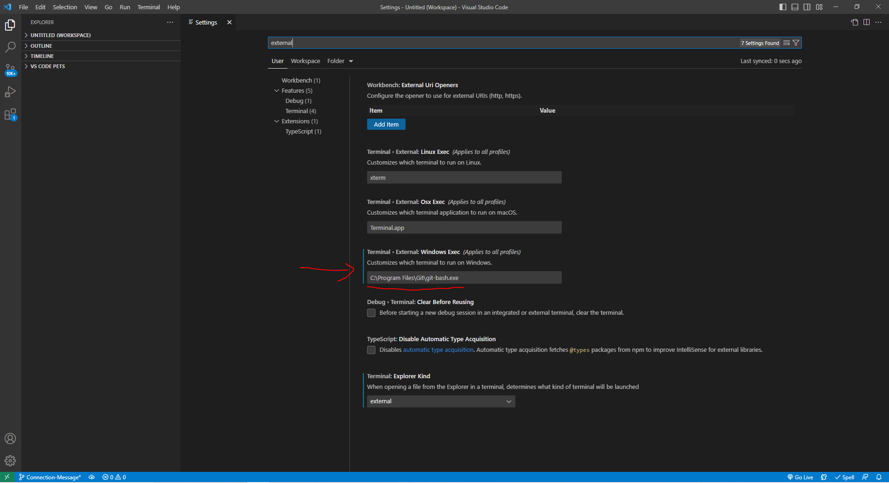

# E-commerce Back End Server Routes


## Description

This project creates the back end for an e-commerce site that will allow users to view, create, update, and delete the following: categories (of products), products, and tags (for the products). 

This project was used to demonstrate the concept of object related-mapping [ORM], which is a technique to convert data from a database into an object for object-orientated programming languages like JavaScript, making database information more manageable through Javascript [JS] commands. This is done by by creating an Express.js API to use [Sequelize (version 6)](https://sequelize.org/docs/v6/), a promise-based Node.js ORM tool, in order to communicate with the site's MySQL database. The development of this project also utilized [Insomnia version 2022.7.5](https://insomnia.rest/) to test the Express APIs which send the SQL querying functions and [MySQL WorkBench version 8.0.32](https://dev.mysql.com/doc/workbench/en/) to visualize the contents of the models along with the changes that occurred.


This project utilizes the following [Node.js version 16.18.0](https://nodejs.org/en/) packages:
* [Node Express.JS version 4.17.1](https://www.npmjs.com/package/express) package from [npm, Inc.](https://www.npmjs.com/) to handle different HTTP methods in an API route. 
* [Node MySQL 2 version 2.3.3](https://www.npmjs.com/package/mysql2) package from [npm, Inc.](https://www.npmjs.com/) to handle MySQL queries. 
* [Node dotenv version 8.2.0](https://www.npmjs.com/package/dotenv) package from [npm, Inc.](https://www.npmjs.com/) to use the environment variables that stored the MySQL username, password, and database name used in development.
* [Node nodemon version 2.0.20 (for development usage only)](https://www.npmjs.com/package/nodemon) package from [npm, Inc.](https://www.npmjs.com/) to automatically restart the node application when file changes in the directory are detected. 

## Table of Contents
- [Installation](#installation)
    - [Git/GitBash](#gitgitbash---strongly-recommended)
    - [Visual Studio Code](#visual-studio-code-vsc---strongly-recommended)
    - [Insomnia (REQUIRED)](#insomnia-version-202275---required-as-a-develop-tool-for-testing-connections-and-express-based-routes-to-database)
    - [MySQL Server/Workbench (REQUIRED)](#mysql-serverworkbench-version-8032---required-to-create-database-locally-viewing-the-database-tables-and-testing-queries)
    - [Node (REQUIRED)](#node-version-16---required-to-download-node-based-dependencies-ie-my-sql-2-express)
        - [express (REQUIRED)](#express-version-4171---required-to-establish-routes-to-database-to-use-my-sql-queries)
        - [mysql2 (REQUIRED)](#mysql2-version-233---required-for-accessing-database)
        - [dotenv (REQUIRED)](#dotenv-version-0100---required-for-using-environment-variables-mysql-username-password-and-database-name-stored-in-env)
        - [nodemon](#nodemon-version-203---recommended-as-a-devdependency-for-updating-server-without-needing-to-close-and-reopen-after-each-change-to-api-route-files)
    - [Sequelize (REQUIRED - can only be used after installing Node)](#sequelize-version-6---required-can-only-be-used-after-installing-node-to-connect-to-database)
- [Usage](#usage---for-the-purposes-of-this-demonstration-git-bash-will-be-used-as-my-preferred-terminal-and-mysql-workbench-will-be-used)
- [Credits](#credits)
- [Questions](#questions)


## Installation

Make sure the following are downloaded:

### `Git/GitBash` - *Strongly Recommended*
* While this application can be run using with the default **command prompt**, it is easier to clone and make further developments to this repository by using Git/GitBash, which can be downloaded [here](https://git-scm.com/downloads).

### `Visual Studio Code [VSC]` - *Strongly Recommended*

* If you'd like to make changes to these files, Visual Studio Code is recommended and can be downloaded for free [here](https://code.visualstudio.com/download).

### `Insomnia version 2022.7.5` - **REQUIRED** as a develop tool for testing connections and express-based routes to database

* Go to [Insomnia's homepage, https://insomnia.rest/](https://insomnia.rest/), then [Pricing](https://insomnia.rest/pricing) and click on the [Download Now](https://insomnia.rest/download) button from the free tier.

* You **do not** need an account to use this application.  

### `MySQL Server/WorkBench version 8.0.32` - **REQUIRED** to create database locally, viewing the database tables, and testing queries

* Follow the Full-Stack Blog's [MySQL Installation Guide](https://coding-boot-camp.github.io/full-stack/mysql/mysql-installation-guide) to download **both** the MySQL Server and the MySQL Workbench for development purposes.

* It is recommended that you make your password 'password' for learning purposes and **ONLY** for MySQL *learning* purposes. **Do not use this for professional usage of MySQL.**

### `Node version 16` - **REQUIRED** to download node-based dependencies (i.e. My SQL 2, express, )
* Go to [Node's homepage, https://nodejs.org/en/](https://nodejs.org/en/), then [Downloads](https://nodejs.org/en/download/) and scroll down to the [Previous Releases](https://nodejs.org/en/download/releases/) bullet point. 

* Toggle between the results until the desired version 16 package and click Download. This application was developed with [Node.js version 16.18.0](https://nodejs.org/dist/v16.18.0/), click on [node-v16.18.0-x64.msi](https://nodejs.org/download/release/v16.18.0/node-v16.18.0-x64.msi) to download.

* The Full-Stack Blog also has [instructions on how to download Node](https://coding-boot-camp.github.io/full-stack/nodejs/how-to-install-nodejs).

#### `express version 4.17.1` - **REQUIRED** to establish routes to database to use My SQL queries

* This **MUST** be installed into this repository, start by opening the command line interface.

* If you have Visual Code Studio, add this repository to the workspace. Then, go to 'Settings' either through the cog icon in the lower left corner and clicking Settings, go to File -> Preferences -> Settings in the menu bar, or the key combo of Ctrl+,

Method 1 - Cog:


Method 2 - File > Preferences > Setting:


* Then, change the settings in "Terminal: Explorer Kind" to "external" in the drop down menu.


        
* Change the filepath of the "Terminal > External: [respective operating system]" settings to the preferred command line interface program (either your system's Command Prompts's file path or Git/Git Bash's file path)



* After that, right-click the repository and select "Open in External Terminal"


* If you do not have VSC, open the preferred terminal.

* Use "cd Desktop" to first reach the Desktop, cd stands for change directory.

* Continue using "cd" to navigate through the file path to reach the location of this repository on your computer.


* Once this repository has been reached, type in `npm i express@4.17.1` into the terminal and hit `Enter`.

#### `mysql2 version 2.3.3` - **REQUIRED** for accessing database

* Follow the same methods from [Express v4.17.1 Installation Section](#express-version-4171---required-to-establish-routes-to-database-to-use-my-sql-queries) to reach this repository if you've already exited out of the command-line, then type in `npm i mysql2@2.3.3` and hit `Enter`.

#### `dotenv version 0.10.0` - **REQUIRED** for using environment variables (MySQL username, password, and database name) stored in .env

* Follow the same methods from [Express v4.17.1 Installation Section](#express-version-4171---required-to-establish-routes-to-database-to-use-my-sql-queries) to reach this repository if you've already exited out of the command-line, then type in `npm i dotenv@8.2.0` and hit `Enter`.

#### `nodemon version 2.0.20` - *Recommended* as a devDependency for updating server without needing to close and reopen after each change to api route files

* Follow the same methods from [Express v4.17.1 Installation Section](#express-version-4171---required-to-establish-routes-to-database-to-use-my-sql-queries) to reach this repository if you've already exited out of the command-line, then type in `npm install -g nodemon` and hit `Enter`.

### `Sequelize version 6` - **REQUIRED [Can only be used *after* installing Node]** to connect to database

* Follow the same methods from [Express v4.17.1 Installation Section](#express-version-4171---required-to-establish-routes-to-database-to-use-my-sql-queries) to reach this repository if you've already exited out of the command-line, then type in `npm install --save sequelize` and hit `Enter`. 

* If you are using another database other than mysql2, follow Sequelize's [Getting Started](https://sequelize.org/docs/v6/getting-started/) instructions for manually installing the respective driver for your database of choice. Otherwise, if you are using mysql2 which was used during the development of this back end server, type in `npm install --save mysql2`.


## Usage - for the purposes of this demonstration, Git Bash will be used as my preferred terminal and MySQL Workbench will be used

* A video of this application's usage can be viewed [here](https://drive.google.com/file/d/1_f5dkOjbTo1rSzolt0RRD8hyyWr05-bj/view?usp=sharing). If the link is non-functional, a copy of the video can be found in the "assets" folder.

* To use this application, start by creating the database in MySQL either through the MySQL environment using MySQL Workbench to use the `CREATE DATABASE ecommerce_db;` script in [db/schema.sql](./db/schema.sql), OR through a command line.
    
    * Regardless of whether you use the command line or workbench, you will have to provide the database's password first. **Do not save your password to the value.**

    

    * If you are creating a database through the Workbench application, type `CREATE DATABASE ecommerce_db;` into the SQL file and click on the lightning bolt icon (#1 in image below) to execute the script. Then, click on the refresh icon (#2 in image below) under SCHEMAS in the Navigation side bar to the left. The ecommerce database will display (#3 in the image below).

    

* Create a `.env` file with the following information (with the database password [DB_PW] being changed to your password that was established in the MySQL Server installation):
    ```
    DB_NAME='ecommerce_db'
    DB_PW='password'
    DB_USER='root'
    ```
    
    * If you plan on uploading changes to this repo to a forked version or a cloned version, use a `.gitignore` to avoid security breaches.

* After the `ecommerce` database is created and the environment file is created, use either of the two methods described in the [Express v4.17.1 Installation Section](#express-version-4171---required-to-establish-routes-to-database-to-use-my-sql-queries) to reach this repository through the preferred terminal.

Method 1:


Method 2:


* Once this repository has been reached, type in `node seeds` into the terminal and hit `Enter` to seed the database with the given information in the [seeds](./seeds/) folder.


* Afterwards, you may start the server connection with `node server.js`. If you plan to make changes to the route files, start the server connection with `nodemon server.js` to ease development, as you will not need to open and close the server connection after each change.

* Then open insomnia and click on the Home icon to the left. Create a new Document or Collection with the Create button on the right. Optional: You can first create a new Project to house the Document/Collection.

    
    * If you're in a Document, select the **Debug** tab, then **New HTTP Request** 

        

    * If you're in a Collection, select **New HTTP Request**.

        

* You may create as many HTTP Requests as you would like and can organize the requests in folders using the plus symbol next to the filter input bar on the left side of the application. You can also create more HTTP requests through this.


* Enter the endpoints (e.g. http://localhost:3001/api/products/) in the console and press Send to make the requests.
    


## Credits

* Sequelize introduction provided by [Sequelize](https://sequelize.org):<br></br> https://sequelize.org/docs/v6/

* Sequelize installation and linkage to database information provided by [Sequelize](https://sequelize.org):<br></br> https://sequelize.org/docs/v6/getting-started/

* Validation and Constraint information provided by [Sequelize](https://sequelize.org):<br></br> https://sequelize.org/docs/v6/core-concepts/validations-and-constraints/

* Model Synchronization information provided by [Sequelize](https://sequelize.org):<br></br> https://sequelize.org/docs/v6/core-concepts/model-basics/#model-synchronization

* `belongsToMany()` Many-to-Many Association Supplemental Lesson provided by [Sequelize](https://sequelize.org):<br></br> https://sequelize.org/api/v6/class/src/associations/belongs-to-many.js~belongstomany

* Associations through Junction Table information provided by [Sequelize](https://sequelize.org):<br></br>https://sequelize.org/docs/v6/core-concepts/assocs/ 

* Showing 2 decimal places for `DataTypes.DECIMAL` credit to [weeraa](https://stackoverflow.com/users/2426128/weeraa):<br></br> https://stackoverflow.com/questions/50354817/sequelize-decimal-data-save-with-2-decimal-points

* Insomnia HTTP Request information provided by [Insomnia Docs](https://docs.insomnia.rest/):<br></br> https://docs.insomnia.rest/insomnia/send-your-first-request


## Questions
If you have any questions, my GitHub profile is [www.github.com/leeclaire156](www.github.com/leeclaire156), and my email is [lee.claire156@gmail.com](mailto:lee.claire156@gmail.com).
